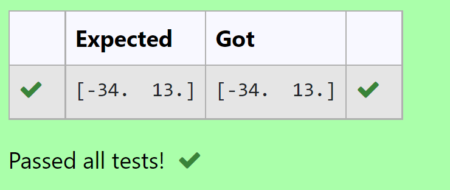

# -SOLUTION-TO-A-SYSTEM-OF-LINEAR-EQUATIONS
## AIM:
To write a python program to find a solution of a system of linear equations.

## EQUIPMENT'S REQUIRED:
1. 	Hardware – PCs
2. 	Anaconda – Python 3.7 Installation / Moodle-Code Runner

## ALGORITHM:
### Step 1: 
Import the numpy module to use the built-in functions for calculation
### Step 2: 
Prepare the lists from each linear equations and assign in np.array()
### Step 3: 
Using the np.linalg.solve(), we can find the solutions.
### Step 4: 
End the program

## PROGRAM:
```
#Program to find a solution of system of linear equations.
#Developed by: Aashima Nazreen Sayeed S
#RegisterNumber: 21500368
import numpy as np
A = np.array ([[1,3],[2,5]])
B = np.array ([5,-3])
value = np.linalg.solve(A,B)
print(value)
```

## OUTPUT:
 


## RESULT: 
Thus the solutions for the linear equations are successfully solved using python program

